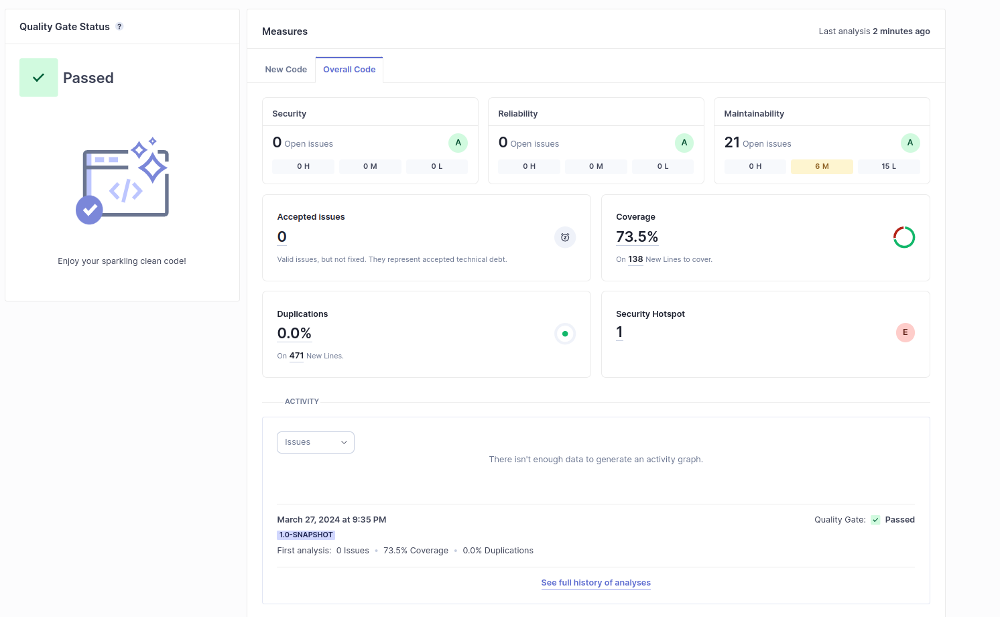

Overall, the code quality appears to be good with a passing quality gate status and high code coverage. 

New Code: Passed  
Overall Code: Passed   
Security: O Open issues (1)  
Reliability: O Open issues (21)  
Maintainability: L Open issues (6)  
Coverage: 73.5%

There are 21 code smells but all of them are medium or low impact.
