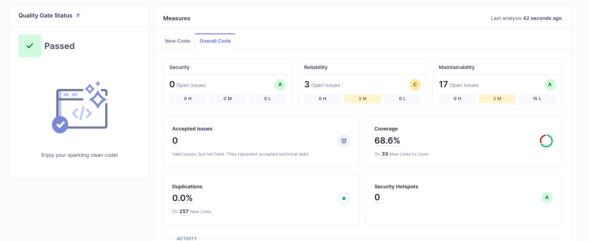

## A)

Technical debt found: 35min  
Represents the cost of solving all the issues.

## B)

No severe code smells found, only medium and low.

## C)

After setting up the jacoco plugin, code coverage was 68.6%.

